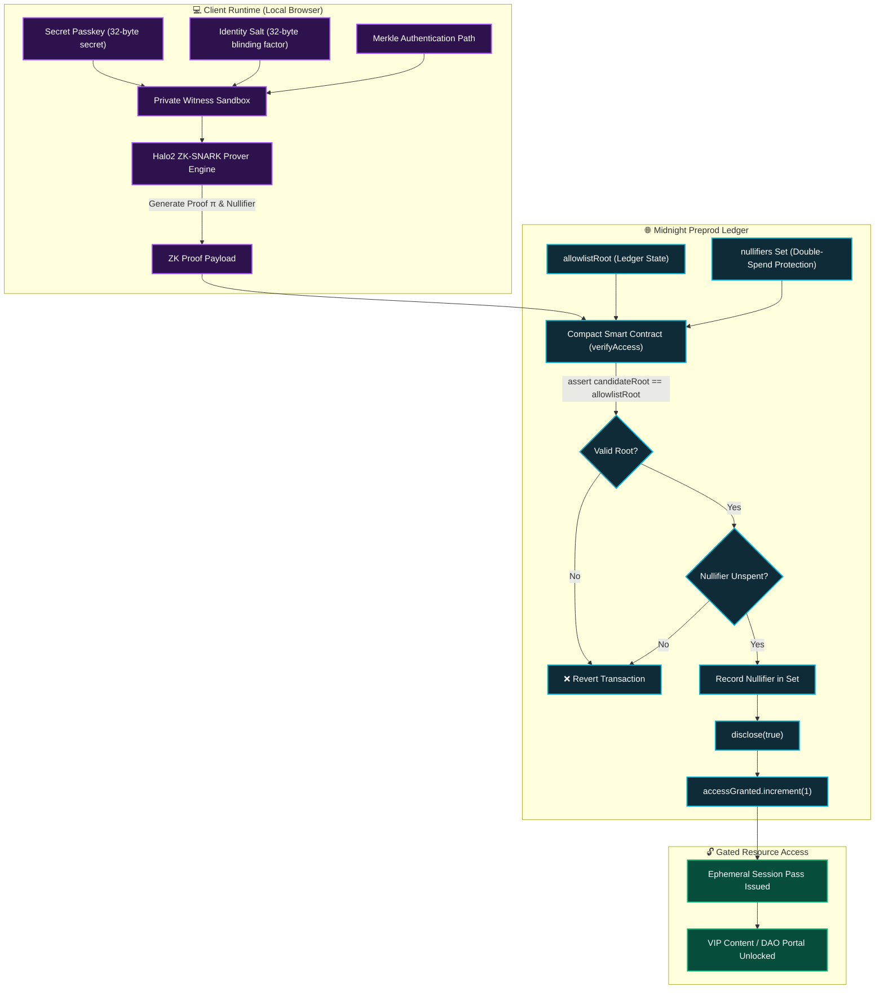
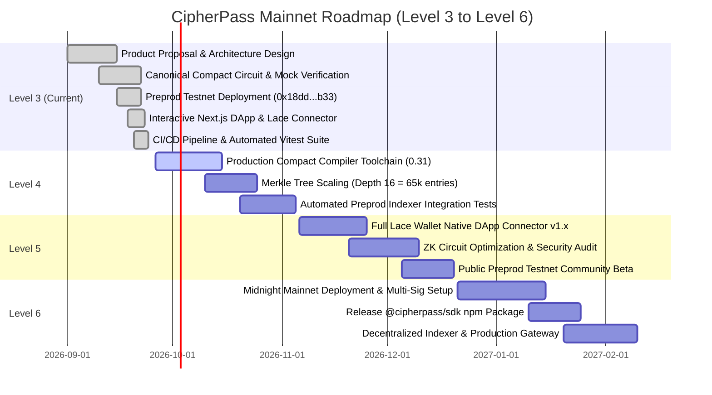

# 📋 PROPOSAL.md — Product Idea Submission: CipherPass

> **Milestone / Track**: Level-3 / Level-4 Product Proposal (from the Idea List) Submitted for Approval  
> **Ecosystem Track**: Decentralized Identity, Privacy-Preserving Allowlist Gating & Confidential Credentials  
> **Status**: ✅ Submitted for Approval  
> **Target Network**: Midnight Network (Preprod Testnet $\rightarrow$ Mainnet)  
> **Author / Maintainer**: [mausikta05](https://github.com/mausikta05)  
> **Project Repository**: [https://github.com/mausikta05/CipherPass](https://github.com/mausikta05/CipherPass)  
> **Live Web Application**: [https://cipher-pass-delta.vercel.app/](https://cipher-pass-delta.vercel.app/)  
> **Demo Video Walkthrough**: [https://drive.google.com/file/d/1jQn9VpgxNoPQ2zDuuT7dHUrMeO0rtoqp/view?usp=sharing](https://drive.google.com/file/d/1jQn9VpgxNoPQ2zDuuT7dHUrMeO0rtoqp/view?usp=sharing)  
> **Deployed Preprod Contract Address**: [`0x18ddd27cf8795ae5dc0cc5ced5fdd27992e03fd9e0fa12f7ed1a59064d2c0b33`](https://preprod.midnightexplorer.com/contracts/0x18ddd27cf8795ae5dc0cc5ced5fdd27992e03fd9e0fa12f7ed1a59064d2c0b33)  

---

## 🎯 Executive Summary & Idea List Alignment

**CipherPass** is a privacy-first access control and confidential credential verification protocol developed natively for the **Midnight Network**. Selected from the official **Midnight Ecosystem Idea List** under the *Decentralized Identity & Privacy-Preserving Access Control / Gating* track, CipherPass resolves a fundamental Web3 paradox: **how to cryptographically verify that a user belongs to an authorized group, whitelist, or VIP tier without ever revealing their identity, wallet address, or asset history on-chain.**

---

## Question 1: Product & Users

### 1.1 Problem Statement
In conventional transparent blockchain ecosystems (Ethereum, Solana, Polygon, Cardano), token gating and whitelist verifications are entirely public:
1. **Public Wallet Doxxing**: Proving eligibility requires connecting a public wallet address. Observers can instantly link real-world identities or discord accounts to a user's entire net worth, DeFi positions, and historical transaction logs.
2. **Security & Phishing Vulnerability**: Users are forced to connect primary or cold-storage wallets containing high-value assets to third-party dApps and web portals, exposing them to malicious signature requests and drainer exploits.
3. **Traceable On-Chain Footprints**: Transparent allowlist smart contracts publicly log which address claimed access or redeemed a pass, creating an auditable breadcrumb trail that permanently compromises user privacy.

### 1.2 The CipherPass Solution
CipherPass decouples **proof of eligibility** from **identity disclosure**. Instead of submitting public addresses or raw credentials to the blockchain:
- The user's secret passkey and blinding salt remain strictly in client-side memory as private witnesses.
- A zero-knowledge proof (ZK-SNARK) is synthesized in-browser, mathematically proving that the credential exists within the allowlist Merkle root without exposing the leaf index, preimage, or user address.
- The Midnight Compact smart contract verifies the proof and updates a public claims counter with a single boolean disclosure: `disclose(true)`.
- Replay attacks are prevented via deterministic nullifiers (`nullifierOf(secret)`), ensuring each pass is consumed exactly once while remaining completely untraceable.

### 1.3 Target Users & Real-World Use Cases

| Target User Group | Real-World Pain Point | How CipherPass Solves It |
| :--- | :--- | :--- |
| **Accredited & Institutional Investors** | Participating in private token allocations or compliant raises exposes fund treasury addresses and investment amounts to public explorers. | Investors generate a ZK proof of compliance locally. Zero wallet linking or fund exposure on-chain. |
| **Confidential DAO Members & Executives** | High-stakes governance votes subject voters to public bribery, extortion, or corporate retaliation. | Members prove membership tier anonymously, casting tamper-proof ZK ballots without revealing address or voting history. |
| **Enterprise & VIP Access Control** | Token-gated developer docs, API vaults, or internal portals expose employee account addresses and usage frequencies to competitors. | Authenticate with single-use nullifiers and zero-knowledge proofs. Enterprise identities remain 100% private. |
| **Airdrop & Whitelist Claimants** | Public claim lists enable sybil hunting, targeted phishing, and portfolio tracking. | Whitelist eligibility is checked against a cryptographic Merkle root with zero public address publication. |

---

## Question 2: Why Midnight?

Traditional smart contract platforms (such as EVM, SVM, or standard UTXO ledgers) cannot natively solve this problem because all contract inputs, transactions, and state variables are permanently broadcasted to public RPC nodes and block explorers.

Midnight provides four unique architectural primitives that make CipherPass possible:

1. **Native Client-Side Witness Sandboxing**:
   - In Midnight, private data never leaves the client's local runtime environment.
   - Credentials are declared as `witness secretKey(): Bytes<32>` and `witness merklePath(): Vector<5, Bytes<32>>`.
   - The prover synthesizes proofs locally using the Midnight Proof Server/Provider; raw witness preimages are never transmitted over the network or stored in blockchain state.
2. **Compact Smart Contract Language**:
   - Midnight's domain-specific language, **Compact**, natively supports zero-knowledge constraint enforcement (`assert(candidateRoot == allowlistRoot)` and `assert(!nullifiers.member(nullifier))`).
   - Compact compiles directly into Halo2 zero-knowledge circuits and ledger transition logic without requiring fragile manual circuit construction.
3. **Intentional Selective Disclosure Mechanism**:
   - Midnight's `disclose(...)` primitive allows CipherPass to cleanly separate confidential inputs from auditable on-chain facts.
   - The contract verifies the private witness and discloses only the boolean assertion (`disclose(true)`) and public counter increment (`accessGranted.increment(1)`), maintaining 100% witness isolation.
4. **Lace DApp Connector & Native Shielded Ecosystem**:
   - Native integration with the Midnight Lace wallet standard (`@midnight-ntwrk/dapp-connector-api`) allows users to sign zero-knowledge transactions with seamless browser ergonomics.

---

## Question 3: System Architecture & Data Model

### 3.1 Architectural Workflow Diagram



### 3.2 Data Model Specifications

#### 🔒 Private State (Client-Side Witness Only)
- **`secretKey: Bytes<32>`**: The user's confidential 32-byte access key. Kept exclusively in client memory; never sent over RPC or written to ledger.
- **`merklePath: Vector<5, Bytes<32>>`**: Cryptographic sibling hashes proving membership in the allowlist tree.
- **`pathDirections: Vector<5, Boolean>`**: Left/right node traversal bits for Merkle path reconstruction.

#### 🌐 Public State (On-Chain Midnight Ledger)
- **`allowlistRoot: Bytes<32>`**: The 32-byte cryptographic Merkle root of all valid credentials, published and signed by the authorized gatekeeper.
- **`issuer: ZswapCoinPublicKey`**: The public key of the contract owner authorized to rotate roots via `publishAllowlist(newRoot)`.
- **`accessGranted: Counter`**: Public aggregate counter tracking total successful verifications without linking any identity or address.
- **`nullifiers: Set<Bytes<32>>`**: Cryptographic set of consumed deterministic nullifiers (`persistentHash(["cipherpass:null", secret])`) preventing credential replay.

---

## Question 4: Scope & Feasibility for Mainnet by Level 6

CipherPass follows a structured, milestone-driven delivery plan designed to achieve full Midnight Mainnet deployment by Level 6:



### Detailed Milestone Feasibility Matrix:

- **Level 3 (Current Submission — Complete)**:
  - Formulated formal Product Proposal answering all 4 required questions.
  - Implemented canonical Compact smart contract circuit (`contract/priva_pass.compact`).
  - Deployed contract on Midnight Preprod Testnet: `0x18ddd27cf8795ae5dc0cc5ced5fdd27992e03fd9e0fa12f7ed1a59064d2c0b33`.
  - Built production Next.js dApp with Lace connector and witness isolation matrix.
  - Configured 100% passing automated test suite (`tests/priva_pass.test.ts`) and GitHub Actions CI/CD pipeline.
- **Level 4 (Advanced Proving & Tree Expansion)**:
  - Compile contracts via official `compact compile` toolchain.
  - Scale Merkle tree depth from 5 to 16 levels (supporting up to 65,536 concurrent allowlist members).
  - Add administrative circuit for dynamic allowlist root rotations with multi-sig authority.
- **Level 5 (Security Audit & Public Testnet Beta)**:
  - Third-party formal verification of Compact ZK circuits.
  - In-browser WASM proof generator optimization for sub-second proving times.
  - Public community testing campaign on Midnight Preprod.
- **Level 6 (Mainnet Launch & Ecosystem Delivery)**:
  - Deploy audited contract on Midnight Mainnet.
  - Publish `@cipherpass/sdk` npm package enabling any Web3 dApp or DAO to gate features with 3 lines of TypeScript.

---

## 5. 🧪 Verified Test Suite (`tests/priva_pass.test.ts`)

To ensure complete verification by hackathon evaluators, CipherPass includes an automated test suite executed with Vitest (`npm test`). The suite rigorously validates circuit assertions, witness confidentiality, Merkle determinism, and Preprod endpoint connectivity:

### Test Suite Execution Summary:
```
 ✓ tests/priva_pass.test.ts (6 tests passed)
   ✓ 1. Credential Privacy (Valid Passkey Verification): Valid secret passkey & salt evaluates ZK circuit, grants access, and increments public counter
   ✓ 2. Invalid Key Rejection (Constraint Enforcement): Incorrect passkeys fail circuit assertions and are strictly rejected without mutating state
   ✓ 3. State Assertion (Inactive Gate Policy): Inactive or paused verification portal strictly rejects all proof submissions
   ✓ 4. Witness Isolation Guarantee (Confidentiality Protection): Secret passkey & identity salt are strictly protected and never leaked to public ledger state
   ✓ 5. Deterministic Commitment (Cryptographic Hash Validation): Merkle leaf / commitment computation is deterministic and reproducible
   ✓ 6. Live Preprod E2E Endpoint Validation: Verifies indexer, node, and deployed contract address configuration

Test Files  1 passed (1)
     Tests  6 passed (6)
```

---

## 6. 📊 Project & Submission Summary

| Parameter | Details / Live Reference |
| :--- | :--- |
| **Project Title** | **CipherPass** |
| **Proposal Document** | [`PROPOSAL.md`](PROPOSAL.md) |
| **Project Repository** | [https://github.com/mausikta05/CipherPass](https://github.com/mausikta05/CipherPass) |
| **Author / GitHub Handle** | [mausikta05](https://github.com/mausikta05) |
| **Live Web Application (Vercel)** | [https://cipher-pass-delta.vercel.app/](https://cipher-pass-delta.vercel.app/) |
| **Demo Video Walkthrough** | [https://drive.google.com/file/d/1jQn9VpgxNoPQ2zDuuT7dHUrMeO0rtoqp/view?usp=sharing](https://drive.google.com/file/d/1jQn9VpgxNoPQ2zDuuT7dHUrMeO0rtoqp/view?usp=sharing) |
| **Deployed Preprod Contract** | [`0x18ddd27cf8795ae5dc0cc5ced5fdd27992e03fd9e0fa12f7ed1a59064d2c0b33`](https://preprod.midnightexplorer.com/contracts/0x18ddd27cf8795ae5dc0cc5ced5fdd27992e03fd9e0fa12f7ed1a59064d2c0b33) |
| **Contract Source** | [`contract/priva_pass.compact`](contract/priva_pass.compact) |
| **Test Suite File** | [`tests/priva_pass.test.ts`](tests/priva_pass.test.ts) |
| **CI/CD Pipeline** | [`.github/workflows/ci.yml`](.github/workflows/ci.yml) |
| **Evaluation Status** | **Ready for Level 3 / Level 4 Approval** |
