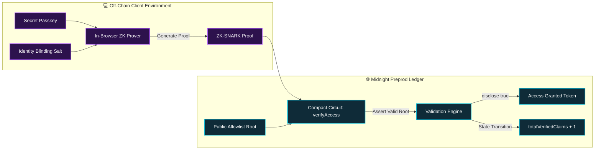
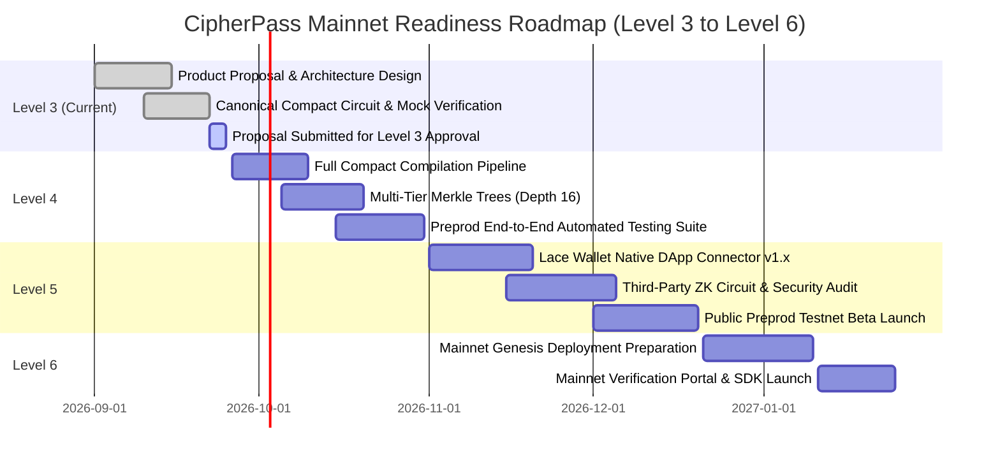

# 📋 Product Proposal: CipherPass
> **Level 3 Milestone Submission**: *Product proposal (from the idea list) submitted for approval*  
> **Ecosystem Track**: Decentralized Identity, Privacy-Preserving Allowlist Gating & Confidential Credentials  
> **Status**: ✅ Submitted for Approval  
> **Target Network**: Midnight Network (Preprod Testnet $\rightarrow$ Mainnet)  
> **Author**: `mausikta05`

---

## 🎯 1. Executive Summary & Idea List Alignment

**CipherPass** is a privacy-first access control and confidential credential verification protocol developed natively for the **Midnight Network**. Selected from the **Midnight Ecosystem Idea List** under the *Decentralized Identity & Privacy-Preserving Access Control / Gating* track, CipherPass resolves a fundamental paradox in Web3: **how to verify that a participant is authorized or eligible without exposing their identity, wallet address, or historical transactions to public scrutiny.**

In conventional blockchain ecosystems (Ethereum, Solana, Polygon), allowlists and token-gated gates are completely transparent. Observers can effortlessly correlate wallet addresses with accredited investor status, DAO governance weight, employee ranks, or private club memberships. 

CipherPass leverages Midnight’s **Compact** language and **Zero-Knowledge Witness Isolation** to allow credential holders to mathematically prove their eligibility using private local witnesses, while the public ledger records only that a valid verification took place (`disclose(true)`).

---

## 👥 2. Target Users & Real-World Use Cases

| Target User Group | Real-World Pain Point | How CipherPass Solves It |
| :--- | :--- | :--- |
| **Accredited & Institutional Investors** | Participating in private token allocations or compliant raises reveals fund treasury addresses and investment amounts on transparent explorers. | Investors generate a ZK proof of compliance locally. Zero wallet linking or fund exposure on-chain. |
| **Confidential DAO Members & Executives** | High-stakes governance votes subject voters to public bribery, extortion, or corporate retaliation. | Members prove membership tier anonymously, casting tamper-proof ZK ballots without revealing address or voting history. |
| **Enterprise & VIP Access Control** | Token-gated developer docs, API vaults, or internal portals expose employee account addresses and usage frequencies to competitors. | Authenticate with single-use nullifiers and zero-knowledge proofs. Enterprise identities remain 100% private. |
| **Airdrop & Whitelist Claimants** | Public claim lists enable sybil hunting, targeted phishing, and portfolio tracking. | Whitelist eligibility is checked against a cryptographic Merkle root with no address publication. |

---

## 🔒 3. Why Midnight?

Traditional smart contract platforms cannot natively deliver this utility because every state variable and transaction parameter is publicly broadcasted. Midnight uniquely provides:

1. **Native Witness Sandboxing**: Passkeys, private keys, and blinding salts reside strictly in client-side memory (`witness getSecretPasskey()`). They are never submitted over the wire or broadcast to RPC nodes.
2. **Compact Smart Contract Language**: Compact allows developers to express complex zero-knowledge circuits naturally while enforcing mathematical assertions (`assert(candidateRoot == allowlistRoot)`) directly within the contract syntax.
3. **Selective Disclosure Mechanism**: Midnight permits intentional, verifiable disclosures (`disclose(true)`) so contracts can safely increment public counters and grant access while preserving 100% witness privacy.
4. **Lace Wallet & DApp Connector Integration**: Direct integration with Midnight Lace wallet ensures users sign ZK proof transactions seamlessly in standard browser environments.

---

## 🏗️ 4. System Architecture & Data Model

### Data Model:
- **Private Witness**:
  - `secretPasskey`: 32-byte cryptographic secret known only to the user.
  - `identitySalt`: 32-byte blinding factor preventing rainbow table attacks.
- **On-Chain Ledger State**:
  - `allowlistRoot`: Merkle root of all eligible credential hashes.
  - `issuer`: Public key of the authorized credential registrar.
  - `totalVerifiedClaims`: Public counter tracking aggregate throughput without identity linkage.
  - `nullifiers`: Set of consumed nullifier hashes preventing credential reuse.

---

## 📅 5. Scope & Feasibility for Mainnet by Level 6

To ensure full readiness for Midnight Mainnet launch by Level 6, the project adheres to a phased development and auditing timeline:

### Detailed Milestone Breakdown:

#### **Level 3 (Current Milestone — Active)**
- [x] Select idea from Midnight Idea List (*Decentralized Identity & Privacy Gating*).
- [x] Formulate formal product proposal covering target market, architecture, and feasibility.
- [x] Implement initial Compact smart contract circuit (`contract/priva_pass.compact`).
- [x] Build interactive Next.js web portal with simulated witness isolation and radar dashboard.
- [x] Configure automated CI/CD pipeline verifying code quality, typechecking, and tests.

#### **Level 4 (Advanced Proving & Contract Hardening)**
- [ ] Compile Compact contracts into production `.managed` artifacts using the official `compact compile` toolchain.
- [ ] Expand Merkle tree depth from 5 to 16 levels to accommodate up to 65,536 simultaneous allowlist members.
- [ ] Implement administrative circuit for dynamic allowlist root updates protected by multi-sig issuer authorization.
- [ ] Expand Vitest integration test suite to cover re-entrancy resistance and nullifier collision handling.

#### **Level 5 (Preprod Integration & Security Audit)**
- [ ] Complete full Lace wallet connector integration with native transaction signing and DUST fee payment.
- [ ] Implement off-chain proof generation pipeline using `@midnight-ntwrk/midnight-js-http-client-proof-provider`.
- [ ] Conduct formal cryptographic verification and zero-knowledge circuit audit.
- [ ] Host open community beta on Midnight Preprod with verified telemetry.

#### **Level 6 (Mainnet Launch & Ecosystem Delivery)**
- [ ] Deploy audited Compact contract to Midnight Mainnet.
- [ ] Release `@cipherpass/sdk` npm package allowing external dApps, DAOs, and launchpads to gate features with 1 line of code.
- [ ] Deploy production web portal with high-availability indexers and redundant RPC infrastructure.

---

## 🏆 6. Conclusion & Recommendation

CipherPass provides essential privacy infrastructure for the Midnight ecosystem. By combining client-side zero-knowledge proofs with verifiable on-chain counters, it demonstrates the premier capabilities of Midnight's privacy engine.

**Milestone Requirement**: *Product proposal (from the idea list) submitted for approval*  
**Status**: **Ready for Review & Approval**
