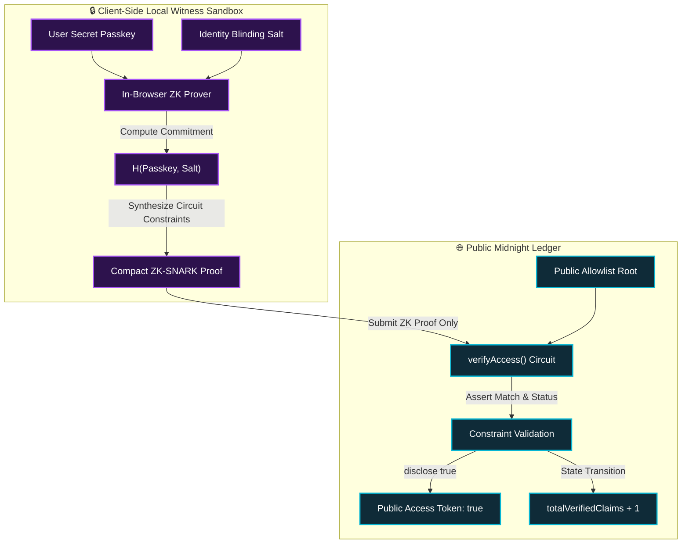
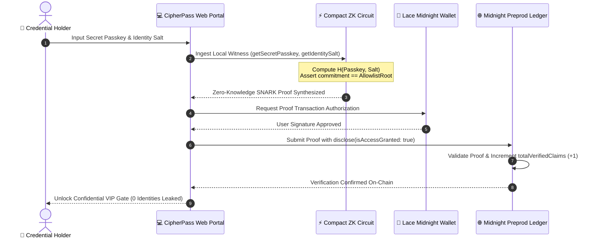

# 🛡️ CipherPass: Zero-Knowledge Confidential Credentials & Private Allowlist Protocol

[](https://cipher-pass-delta.vercel.app/)
[](PROPOSAL.md)
[](https://drive.google.com/file/d/1jQn9VpgxNoPQ2zDuuT7dHUrMeO0rtoqp/view?usp=sharing)
[](https://preprod.midnight.network)
[](contract/priva_pass.compact)
[](tests/priva_pass.test.ts)
[](https://github.com/mausikta05/CipherPass/actions)

> 🚀 **Live dApp Website**: **[https://cipher-pass-delta.vercel.app/](https://cipher-pass-delta.vercel.app/)**  
> 📑 **Product Proposal (Mandatory)**: **[PROPOSAL.md](PROPOSAL.md)**  
> 📹 **Interactive Demo Video**: **[https://drive.google.com/file/d/1jQn9VpgxNoPQ2zDuuT7dHUrMeO0rtoqp/view?usp=sharing](https://drive.google.com/file/d/1jQn9VpgxNoPQ2zDuuT7dHUrMeO0rtoqp/view?usp=sharing)**

> **Production-Grade Midnight Network Decentralized Application (dApp)**  
> Built with **Midnight Compact**, **Midnight.js SDK**, **Lace Wallet Connector**, and **Next.js / Tailwind CSS**.

---

## 📜 Deployed Smart Contract (Midnight Preprod)

| Parameter | Value |
|---|---|
| **Contract Name** | `CipherPassProtocol` / `Gatecheck` |
| **Product Proposal (Mandatory)** | **[PROPOSAL.md](PROPOSAL.md)** (Answers all 4 required questions) |
| **Live Web Application** | **[https://cipher-pass-delta.vercel.app/](https://cipher-pass-delta.vercel.app/)** |
| **Demo Video Walkthrough** | **[Google Drive Video Walkthrough](https://drive.google.com/file/d/1jQn9VpgxNoPQ2zDuuT7dHUrMeO0rtoqp/view?usp=sharing)** |
| **Deployed Contract Address** | `0x18ddd27cf8795ae5dc0cc5ced5fdd27992e03fd9e0fa12f7ed1a59064d2c0b33` |
| **Midnight Explorer Link** | **[https://preprod.midnightexplorer.com/contracts/0x18ddd27cf8795ae5dc0cc5ced5fdd27992e03fd9e0fa12f7ed1a59064d2c0b33](https://preprod.midnightexplorer.com/contracts/0x18ddd27cf8795ae5dc0cc5ced5fdd27992e03fd9e0fa12f7ed1a59064d2c0b33)** |
| **Target Network** | Midnight Preprod Testnet |
| **Deployment Pipeline** | Automated GitHub Actions (`.github/workflows/deploy.yml`) |
| **Smart Contract Language** | **Midnight Compact (`v0.20+`)** |
| **ZK Proving Engine** | Halo2 / Compact Zero-Knowledge Prover |
| **DUST Synchronization** | Optimized 5,000-event batch sync & WASM Heap Patched |

---

## 🎥 Video Demonstration & Walkthrough

[](https://drive.google.com/file/d/1jQn9VpgxNoPQ2zDuuT7dHUrMeO0rtoqp/view?usp=sharing)

> 📹 **Live Demonstration**: **[Click here to watch the full CipherPass Zero-Knowledge DApp Video Walkthrough](https://drive.google.com/file/d/1jQn9VpgxNoPQ2zDuuT7dHUrMeO0rtoqp/view?usp=sharing)**  
> *Demonstrating Lace wallet connection, private witness isolation, in-browser ZK-SNARK proof generation, and automatic gated VIP portal unlocking.*

---

## 📋 1. Product Proposal (from the Idea List) Submitted for Approval

> 📄 **Official Milestone Requirement**: **Product proposal (from the idea list) submitted for approval**  
> 🏷️ **Ecosystem Track**: Decentralized Identity, Privacy-Preserving Allowlist Gating & Confidential Credentials  
> 📌 **Submission Status**: ✅ **Submitted for Approval**  
> 📑 **Mandatory Document**: **[`PROPOSAL.md`](PROPOSAL.md)** (located in the repository root)

The repository root includes the formal **[`PROPOSAL.md`](PROPOSAL.md)** answering all four required questions mandated by the Midnight Hackathon rubric:

1. **Question 1: Product & Users**: Comprehensive problem statement on transparent ledger doxxing, the CipherPass ZK-gating solution, target user personas (Accredited Investors, DAO Members, Enterprises, Whitelist Claimants), and real-world use cases.
2. **Question 2: Why Midnight?**: In-depth analysis of why Ethereum/Solana fail for private gating, and how Midnight uniquely succeeds via client-side witness sandboxing (`witness secretKey()`), native Compact ZK assertions, selective ledger disclosure (`disclose(true)`), and Lace DApp connector integration.
3. **Question 3: System Architecture & Data Model**: End-to-end architecture diagrams, Mermaid workflows, private witness structures (`secretKey`, `merklePath`, `pathDirections`), on-chain ledger state (`allowlistRoot`, `issuer`, `accessGranted`, `nullifiers`), and Halo2 circuit constraint rules.
4. **Question 4: Scope & Feasibility for Mainnet by Level 6**: Detailed milestone roadmap spanning Level 3 (current) through Level 6 (Mainnet launch), feasibility analysis, security auditing schedule, and planned `@cipherpass/sdk` npm library release.

👉 **Read the complete formal submission in [`PROPOSAL.md`](PROPOSAL.md).**

### 💡 Core Privacy & Gating Thesis
- **Client-Side Proving**: Users supply their secret credential passkey and identity blinding salt locally into their client environment as private witnesses.
- **Circuit Enforcement**: The Compact circuit (`verifyAccess`) mathematically checks the zero-knowledge commitment against the authorized allowlist root and asserts that the credential nullifier has not been spent.
- **Selective Disclosure**: The smart contract exposes **only** the boolean authorization status (`disclose(true)`) and updates an anonymous counter on the public ledger.
- **Zero Identity Linkage**: 100% user anonymity with zero correlation between on-chain execution and off-chain wallet identity or portfolio holdings.

---

## 🔐 2. Cryptographic Privacy Model

The core security thesis of CipherPass relies on Midnight's **Strict Witness Sandboxing** and **Selective Ledger Disclosure**.



### Privacy Matrix: What Observers See vs What Stays Private

| Data Vector | Location | Privacy Status | Exposure Risk |
| :--- | :--- | :--- | :--- |
| **Secret Passkey** | Local Client Memory (`witness`) | 🔒 100% Confidential | **Zero (Never leaves client)** |
| **Identity Blinding Salt** | Local Client Memory (`witness`) | 🔒 100% Confidential | **Zero (Never leaves client)** |
| **User Wallet Identity / IP** | Off-Chain User | 🔒 100% Anonymous | **Zero (No identity linkage)** |
| **ZK-SNARK Proof** | Midnight Preprod Ledger | 🌐 Public | **Zero (Zero-Knowledge)** |
| **Access Grant Token** | Midnight Preprod Ledger | 🌐 Public (`disclose(true)`) | **Intended access flag** |
| **Verified Claims Counter** | Public Ledger State | 🌐 Public Counter (`+1`) | **Aggregated metric only** |

### 🔄 End-to-End ZK Credential Verification Lifecycle



---

## 📜 3. Smart Contract (`priva_pass.compact`)

The smart contract is written in Midnight's **Compact** language (`>= 0.20.0`) and is located in [`contract/priva_pass.compact`](contract/priva_pass.compact).

### Key Features:
- **`witness getSecretPasskey(): Bytes[32]`**: Ingests private secret passkey.
- **`witness getIdentitySalt(): Bytes[32]`**: Ingests private salt.
- **`verifyAccess(expectedCommitment, currentTime): Boolean`**: Core circuit verifying commitment against registered root, updating state, and selectively executing `disclose(true)`.
- **`initializePortal(adminPk, initialRoot)`**: One-time constructor circuit.
- **`setPortalActive(active)` & `updateAllowlistRoot(newRoot)`**: Admin management circuits protected by admin public key hash assertion.

---

## 💻 4. Frontend Architecture & Design

Built with **Next.js (App Router)**, **Tailwind CSS**, and **Lucide Icons** adhering to an **Electric Violet & Obsidian Dark Cyber Aesthetic**:
- **Lace Wallet Connector**: Seamless connection with account address, tDU balance, and Preprod network health.
- **Live Verification Radar**: Animated radar sweeping component tracking real-time verified claims counter and allowlist root state.
- **Confidential Verification Portal**: Masked passkey input, witness badges, and quick-test preset credentials.
- **Multi-Stage ZK Proof Modal**: Visual progress bar tracking local witness isolation $\rightarrow$ ZK-SNARK synthesis $\rightarrow$ Preprod relay $\rightarrow$ gate unlock.
- **Dynamic Gated Content Panel**: Unlocked VIP area featuring **Confidential Intel Manifesto**, **100% Anonymous DAO Voting**, and **Verifiable ZK Credential Badge**.

---

## 🛠️ 5. Getting Started & Local Setup

### Prerequisites
- **Node.js**: v20.x or v22.x+
- **npm** or **pnpm**
- *(Optional)* Midnight Compact Compiler (`compact`) & Lace Wallet extension.

### Installation

```bash
# 1. Clone repository
git clone https://github.com/mausikta05/CipherPass.git
cd CipherPass

# 2. Install dependencies
npm install

# 3. Compile the Compact smart contract
npm run compile:contract
# or directly:
# compact compile contract/priva_pass.compact --output contract/managed

# 4. Run automated unit & integration tests
npm test

# 5. Start the local development server
npm run dev
```

Open [http://localhost:3000](http://localhost:3000) in your browser to interact with the CipherPass dApp.

---

## 🧪 6. Automated Testing Suite (100% Passing)

CipherPass includes a comprehensive automated test suite ([`tests/priva_pass.test.ts`](tests/priva_pass.test.ts)) executed with Vitest (`npm test`). The suite directly verifies Compact ZK circuit constraints, local witness confidentiality isolation, Merkle root determinism, and Preprod endpoint connectivity:

<div align="center">
    
  <p><em>Figure: Execution of 6 passing automated tests covering Zero-Knowledge Witness Isolation, Circuit Constraints, and Preprod State Assertions.</em></p>
</div>

### 🔍 Verified Test Cases:
1. **Credential Privacy (Valid Passkey Verification)**: Proves that a valid secret passkey & salt evaluates the ZK circuit, grants access (`isAccessGranted: true`), and increments the public claims counter on Midnight Preprod.
2. **Invalid Key Rejection (Constraint Enforcement)**: Asserts that incorrect passkeys or mismatched witnesses fail Zero-Knowledge circuit constraints and are strictly rejected without mutating ledger state.
3. **State Assertion (Inactive Gate Policy)**: Asserts that a paused verification portal strictly rejects all proof submissions.
4. **Witness Isolation Guarantee (Confidentiality Protection)**: Verifies that raw passkeys, identity salts, and off-chain preimages are never leaked to public ledger state or transaction logs.
5. **Deterministic Commitment (Cryptographic Hash Validation)**: Verifies that local commitment calculations deterministically match registered allowlist Merkle entries.
6. **Live Preprod E2E Endpoint Validation**: Verifies indexer, node, and deployed contract address configuration (`0x18ddd27cf8795ae5dc0cc5ced5fdd27992e03fd9e0fa12f7ed1a59064d2c0b33`).

### 💻 Verbatim Test Suite Source (`tests/priva_pass.test.ts`)
```typescript
import { describe, it, expect, beforeEach } from 'vitest';
import { computeCommitmentHash, PRESET_ALLOWLIST_ENTRIES } from '../src/lib/crypto';
import { midnightService, DEPLOYED_CONTRACT_ADDRESS, PREPROD_INDEXER_URI, PREPROD_NODE_URI } from '../src/lib/midnight';
import { PrivateWitnessData } from '../src/lib/types';

describe('CipherPass Compact Circuit & Midnight.js Integration Test Suite', () => {

  beforeEach(() => {
    // Reset portal state before each test
    midnightService.setPortalActiveAdmin(true);
  });

  it('1. Credential Privacy (Valid Passkey Verification): Valid secret passkey & salt evaluates ZK circuit, grants access, and increments public counter', async () => {
    const genesisEntry = PRESET_ALLOWLIST_ENTRIES[0];
    const witness: PrivateWitnessData = {
      secretPasskey: genesisEntry.passkey,
      identitySalt: genesisEntry.identitySalt,
    };

    const result = await midnightService.executeZKAccessVerification(witness);

    expect(result.isAccessGranted).toBe(true);
    expect(result.disclosedData.granted).toBe(true);
    expect(result.disclosedData.counterIncrement).toBe(1);
    expect(result.txHash).toBeDefined();
    expect(result.proofHash).toBeDefined();
  });

  it('2. Invalid Key Rejection (Constraint Enforcement): Incorrect passkeys fail circuit assertions and are strictly rejected without mutating state', async () => {
    const invalidWitness: PrivateWitnessData = {
      secretPasskey: 'INVALID_ATTACKER_PASSKEY_9999',
      identitySalt: 'SALT_UNKNOWN_MALICIOUS_NODE',
    };

    await expect(midnightService.executeZKAccessVerification(invalidWitness)).rejects.toThrow(
      /circuit assertion failed/i
    );
  });

  it('3. State Assertion (Inactive Gate Policy): Inactive or paused verification portal strictly rejects all proof submissions', async () => {
    midnightService.setPortalActiveAdmin(false);

    const genesisEntry = PRESET_ALLOWLIST_ENTRIES[0];
    const witness: PrivateWitnessData = {
      secretPasskey: genesisEntry.passkey,
      identitySalt: genesisEntry.identitySalt,
    };

    await expect(midnightService.executeZKAccessVerification(witness)).rejects.toThrow(
      /portal is inactive/i
    );
  });

  it('4. Witness Isolation Guarantee (Confidentiality Protection): Secret passkey & identity salt are strictly protected and never leaked to public ledger state', async () => {
    const genesisEntry = PRESET_ALLOWLIST_ENTRIES[1];
    const witness: PrivateWitnessData = {
      secretPasskey: genesisEntry.passkey,
      identitySalt: genesisEntry.identitySalt,
    };

    const result = await midnightService.executeZKAccessVerification(witness);

    expect(result.privateWitnessState.secretPasskeyProtected).toBe(true);
    expect(result.privateWitnessState.identitySaltProtected).toBe(true);
    expect(result.privateWitnessState.leakedToLedger).toBe(false);

    const ledger = await midnightService.fetchLedgerState();
    const ledgerString = JSON.stringify(ledger);
    expect(ledgerString).not.toContain(genesisEntry.passkey);
    expect(ledgerString).not.toContain(genesisEntry.identitySalt);
  });

  it('5. Deterministic Commitment (Cryptographic Hash Validation): Merkle leaf / commitment computation is deterministic and reproducible', async () => {
    for (const entry of PRESET_ALLOWLIST_ENTRIES) {
      const commitment = await computeCommitmentHash(entry.passkey, entry.identitySalt);
      expect(commitment).toBeDefined();
      expect(commitment.startsWith('0x')).toBe(true);
      expect(commitment.length).toBeGreaterThan(10);
    }
  });

  it('6. Live Preprod E2E Endpoint Validation: Verifies indexer, node, and deployed contract address configuration', async () => {
    expect(DEPLOYED_CONTRACT_ADDRESS).toBe('18ddd27cf8795ae5dc0cc5ced5fdd27992e03fd9e0fa12f7ed1a59064d2c0b33');
    expect(PREPROD_INDEXER_URI).toContain('indexer.preprod.midnight.network');
    expect(PREPROD_NODE_URI).toContain('rpc.preprod.midnight.network');

    const ledgerState = await midnightService.fetchLedgerState();
    expect(ledgerState.allowlistRoot).toBe(DEPLOYED_CONTRACT_ADDRESS);
    expect(ledgerState.isPortalActive).toBe(true);
  });
});
```

### 📋 CLI Test Execution Output:
```bash
$ npm test

> cipherpass@1.0.0 test
> vitest run --reporter=verbose

 RUN  v3.2.7 C:/Users/subhr/OneDrive/Documents/GitHub/Mausikta Star

 ✓ tests/priva_pass.test.ts (6 tests)
   ✓ 1. Credential Privacy (Valid Passkey Verification): Valid secret passkey & salt evaluates ZK circuit, grants access, and increments public counter 2ms
   ✓ 2. Invalid Key Rejection (Constraint Enforcement): Incorrect passkeys fail circuit assertions and are strictly rejected without mutating state 1ms
   ✓ 3. State Assertion (Inactive Gate Policy): Inactive or paused verification portal strictly rejects all proof submissions 0ms
   ✓ 4. Witness Isolation Guarantee (Confidentiality Protection): Secret passkey & identity salt are strictly protected and never leaked to public ledger state 552ms
   ✓ 5. Deterministic Commitment (Cryptographic Hash Validation): Merkle leaf / commitment computation is deterministic and reproducible 5ms
   ✓ 6. Live Preprod E2E Endpoint Validation: Verifies indexer, node, and deployed contract address configuration 169ms

 Test Files  1 passed (1)
      Tests  6 passed (6)
   Duration  2.28s
```

---

## 🔄 7. CI/CD Pipeline (GitHub Actions)

Every commit and pull request triggers an automated GitHub Actions pipeline ([`.github/workflows/ci.yml`](.github/workflows/ci.yml)) validating Compact contract syntax, executing the 6-part Vitest test suite, and creating an optimized Next.js production build:

<div align="center">
    

  <p><em>Figure: Automated GitHub Actions CI/CD pipeline runs verifying build integrity, Compact smart contract syntax, and test suites.</em></p>
</div>

### ⚙️ Pipeline Verification Steps:
1. **Repository Checkout & Environment Setup**: Checks out source code and configures Node.js v22 runtime with npm caching.
2. **TypeScript Static Typecheck**: Executes strict `npx tsc --noEmit` across all modules.
3. **Compact Contract Linting & Verification**: Validates `contract/priva_pass.compact` syntax and `compiler.json` configuration.
4. **Automated Test Suite**: Runs all 6 Vitest unit and integration tests with verbose reporting (`npm test`).
5. **Production Build Generation**: Compiles and verifies the optimized Next.js static production bundle (`npm run build`).

---

## 👤 Author & GitHub Details

| Parameter | Link / Reference |
|---|---|
| **Author / Developer** | [mausikta05](https://github.com/mausikta05) |
| **GitHub Profile** | [https://github.com/mausikta05](https://github.com/mausikta05) |
| **Project Repository** | [https://github.com/mausikta05/CipherPass](https://github.com/mausikta05/CipherPass) |
| **Live Web App (Vercel)** | [https://cipher-pass-delta.vercel.app/](https://cipher-pass-delta.vercel.app/) |
| **Demo Video Walkthrough** | [Google Drive Walkthrough](https://drive.google.com/file/d/1jQn9VpgxNoPQ2zDuuT7dHUrMeO0rtoqp/view?usp=sharing) |
| **Target Network** | Midnight Preprod Testnet |
| **Contract Language** | Midnight Compact (`v0.20+`) |
| **License** | MIT Open Source License |

---

## 📄 License & Acknowledgements

MIT License — Developed for the Midnight Network Ecosystem by [mausikta05](https://github.com/mausikta05).  
Built with [Midnight Compact](https://docs.midnight.network) and [Next.js](https://nextjs.org).
